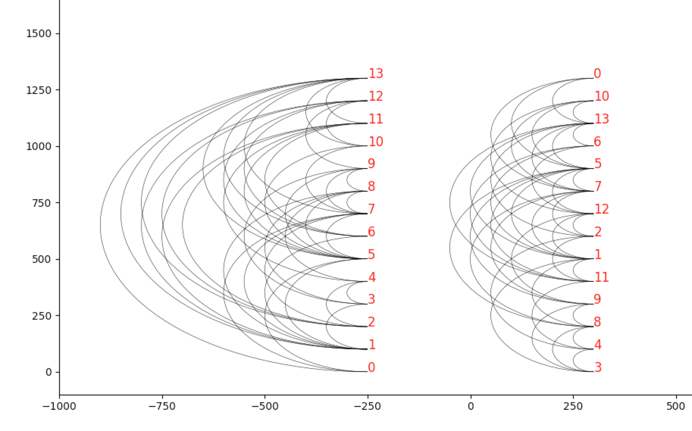

# arc-diagrams-barycenter
Implementation of [Arc Diagrams and Barycenter Ordering](https://pdfs.semanticscholar.org/9f0f/5a1507b83f96bcedbf2b8971fde21948b086.pdf)

### Requirements

`pip3 install -r requirements`

### How to run

`python3 ./src/main.py -v 8`

Where
  * -v/vertices - number of vertices in random graph

### Example
Arc diagrams of 14-node. 
 * Left: with a random ordering
 * Right: after applying the barycenter heuristic

